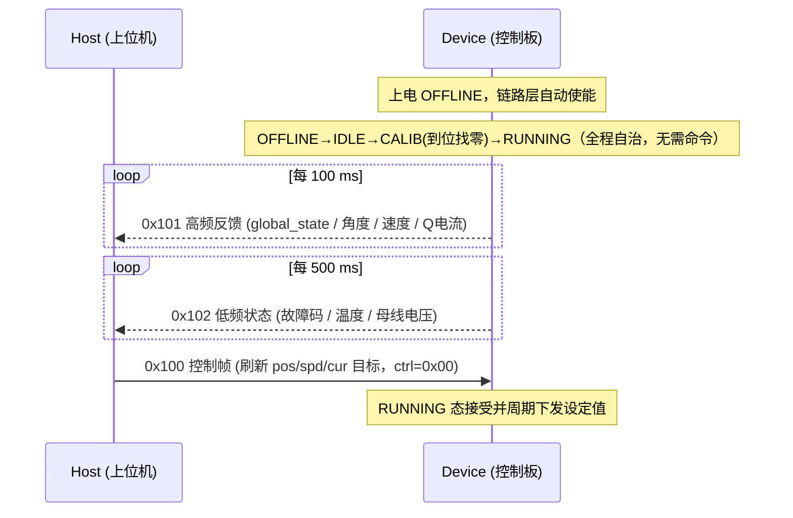

# CAN FD 灵巧手电机控制协议规范

| 项目 | 信息 |
|------|------|
| **文档版本** | V1.1.0 |
| **作者** | maximillian |
| **创建日期** | 2026-07-09 |
| **最后更新** | 2026-07-10 |
| **目标 MCU** | STM32G474 (Cortex-M4 FPv4-SP, 512 KB Flash / 128 KB SRAM) |
| **传输层** | CAN FD (FDCAN1, ISO 11898-1, `FDCAN_FRAME_FD_NO_BRS`) |

---

## 1. 系统架构

上位机通过 **单帧广播** 一次性下发全部 9 个关节电机的控制指令，控制板周期性自动上报高频运动反馈与低频状态，无需上位机轮询。

| 设计原则 | 说明 |
|----------|------|
| 单帧广播控制 | 一帧 `0x100` 携带 9 电机的位置/速度/电流目标，避免逐电机寻址 |
| 主动周期反馈 | 控制板自动发送 `0x101`(100 ms) / `0x102`(500 ms)，上位机只收不轮询 |
| 冷热数据分离 | 高频(角度/速度/电流) 与低频(状态/故障/温度/电压) 分帧，节省总线带宽 |
| 定长帧 | 三种帧长度固定，接收方按固定偏移解析，无需变长解码 |
| 小端定标 | 多字节字段统一小端 + Q 定标，MCU 端零转换直存 |

---

## 2. 通信链路层

### 2.1 物理层

| 项目 | 值 |
|------|-----|
| 控制器 | FDCAN1（`PA11` RX / `PA12` TX） |
| 帧格式 | 标准帧（11-bit 标识符）+ CAN FD 数据段 |
| FD 模式 | `FDCAN_FRAME_FD_NO_BRS`（FD 帧，数据段不切换比特率） |
| 字节序 | 小端（Intel, LSB first） |
| 定标 | Q7 / Q15 定点（见 §4.1） |

### 2.2 CAN FD DLC 编码

CAN FD 的 DLC 与实际字节数非线性对应，驱动层（`drv_can`）内部自动查表互转，应用层 `dlc` 字段始终填 **实际字节数**。

| DLC | 字节数 | DLC | 字节数 |
|-----|--------|-----|--------|
| `0`–`8` | 0–8 | `12` | 24 |
| `9` | 12 | `13` | 32 |
| `10` | 16 | `14` | 48 |
| `11` | 20 | `15` | 64 |

### 2.3 CAN 标识符分配

| CAN ID | 宏定义 | 方向 | 周期 | 长度 | 说明 |
|--------|--------|------|------|------|------|
| `0x100` | `SRV_CAN_ID_CTRL` | H→D | 上位机触发 | 64 B | 控制帧（使能 + 位置/速度/电流目标） |
| `0x101` | `SRV_CAN_ID_FEEDBACK` | D→H | 100 ms | 64 B | 高频反馈（状态 + 角度/速度/Q 电流） |
| `0x102` | `SRV_CAN_ID_STATUS` | D→H | 500 ms | 48 B | 低频状态（状态 + 故障/温度/电压） |

> H = Host（上位机），D = Device（灵巧手控制板）。

---

## 3. 协议帧定义

> 所有多字节字段均为 **小端**；`[9]` 表示 9 个电机的数组，索引映射见 §4.5。

### 3.1 控制帧 `0x100` (H→D)

**概述**：上位机下发的唯一控制帧，一帧携带 9 电机的使能命令与位置/速度/电流目标。DLC=15 (64 B)，其中 55 B 有效 + 9 B 保留。

| Byte 0 | Byte 1–18 | Byte 19–36 | Byte 37–54 | Byte 55–63 |
|--------|-----------|------------|------------|------------|
| `ctrl` | `pos_ref[9]` | `spd_ref[9]` | `cur_ref[9]` | reserved |

| 字段 | 偏移 | 长度 | 类型 | 格式 | 说明 |
|------|------|------|------|------|------|
| `ctrl` | Byte 0 | 1 | `uint8_t` | 位域 | **已废弃**（V1.2 起固件忽略此字节，写 0 即可） |
| `pos_ref[9]` | Byte 1 | 18 | `int16_t[9]` | Q7, LE | 目标角度，`raw = deg × 128` |
| `spd_ref[9]` | Byte 19 | 18 | `int16_t[9]` | Q15, LE | 目标速度 / 位置模式限速，`0~32767 → 0~50 krpm` |
| `cur_ref[9]` | Byte 37 | 18 | `int16_t[9]` | Q15, LE | 电流限制，`0~32767 → 0~5.625 A` |
| reserved | Byte 55 | 9 | — | — | 保留，填 `0x00` |

> `ctrl` 已废弃：电机使能由控制板上电自治完成，FAULT 由 `err_code` 清零自动恢复，
> 上位机无需也无法通过 `ctrl` 干预；字段保留占位以维持帧布局兼容，建议写 `0x00`。

### 3.2 高频反馈帧 `0x101` (D→H)

**概述**：控制板每 100 ms 主动上报的运动反馈帧，携带整体行为状态与 9 电机的角度/速度/Q 电流。DLC=15 (64 B)，恰好填满。

| Byte 0 | Byte 1–9 | Byte 10–27 | Byte 28–45 | Byte 46–63 |
|--------|----------|------------|------------|------------|
| `global_state` | `fsm_state[9]` | `angle_fb[9]` | `speed_fb[9]` | `q_cur[9]` |

| 字段 | 偏移 | 长度 | 类型 | 格式 | 说明 |
|------|------|------|------|------|------|
| `global_state` | Byte 0 | 1 | `uint8_t` | 枚举 | 整体行为状态（见 §4.2） |
| `fsm_state[9]` | Byte 1 | 9 | `uint8_t[9]` | 枚举 | 每电机硬件状态机（见 §4.3） |
| `angle_fb[9]` | Byte 10 | 18 | `int16_t[9]` | Q7, LE | 当前角度，`deg = raw / 128` |
| `speed_fb[9]` | Byte 28 | 18 | `int16_t[9]` | Q15, LE | 当前转速，`krpm = raw × 50 / 32768` |
| `q_cur[9]` | Byte 46 | 18 | `int16_t[9]` | Q15, LE | Q 轴电流，`A = raw × 5.625 / 32768` |

### 3.3 低频状态帧 `0x102` (D→H)

**概述**：控制板每 500 ms 主动上报的状态帧，携带故障码/温度/母线电压。DLC=14 (48 B)，其中 46 B 有效 + 2 B 保留。

| Byte 0 | Byte 1–9 | Byte 10–18 | Byte 19–27 | Byte 28–45 | Byte 46–47 |
|--------|----------|------------|------------|------------|------------|
| `global_state` | `fsm_state[9]` | `err_code[9]` | `temp[9]` | `vbus[9]` | reserved |

| 字段 | 偏移 | 长度 | 类型 | 格式 | 说明 |
|------|------|------|------|------|------|
| `global_state` | Byte 0 | 1 | `uint8_t` | 枚举 | 整体行为状态（见 §4.2） |
| `fsm_state[9]` | Byte 1 | 9 | `uint8_t[9]` | 枚举 | 每电机硬件状态机（见 §4.3） |
| `err_code[9]` | Byte 10 | 9 | `uint8_t[9]` | 枚举 | 每电机故障码（见 §4.4） |
| `temp[9]` | Byte 19 | 9 | `int8_t[9]` | — | MCU 温度，`°C = raw − 50` |
| `vbus[9]` | Byte 28 | 18 | `int16_t[9]` | LE | 母线电压，`V = raw / 128` |
| reserved | Byte 46 | 2 | — | — | 保留，填 `0x00` |

---

## 4. 数据编码与枚举

### 4.1 Q 格式换算

| 字段 | 类型 | 还原公式 | 反向公式 | 单位 |
|------|------|----------|----------|------|
| `pos_ref` / `angle_fb` | `int16_t` (Q7) | `deg = raw / 128` | `raw = deg × 128` | ° |
| `spd_ref` / `speed_fb` | `int16_t` (Q15) | `krpm = raw × 50 / 32768` | `raw = krpm × 32768 / 50` | krpm |
| `cur_ref` / `q_cur` | `int16_t` (Q15) | `A = raw × 5.625 / 32768` | `raw = A × 32768 / 5.625` | A |
| `temp` | `int8_t` | `°C = raw − 50` | `raw = °C + 50` | °C |
| `vbus` | `int16_t` | `V = raw / 128` | `raw = V × 128` | V |

### 4.2 `global_state`（整体行为状态）

| 值 | 名称 | 说明 |
|----|------|------|
| `0` | `INIT` | 保留值（协议兼容），固件不再上报 |
| `1` | `OFFLINE` | 离线，全部电机反馈超时（单电机 200ms 无反馈由看门狗判定） |
| `2` | `IDLE` | 在线，已就绪（对应电机 `mcReady`） |
| `3` | `CALIB` | 零点校准中（到位找零，上电首次自动执行） |
| `4` | `RUNNING` | 正常运行（存在电机 `mcRun`） |
| `5` | `FAULT` | 故障，已自动去使能 |

> 自 V1.2 起行为状态机为 `OFFLINE → IDLE → CALIB → RUNNING`（任意态 → `FAULT`）：
> 电机的使能/模式序列由控制板链路层上电自治完成；上电首次检测到电机运行后自动进入
> `CALIB` 到位找零（下发 180° 目标 + 小电流，位置反馈到达目标容差内即设零）；
> **`0x100` 帧的目标值仅在 `RUNNING` 态生效**，其余状态（含校准期间）目标值被忽略；
> `ctrl` 字节已废弃；校准完成后进入 `RUNNING`，此后 `IDLE ⇄ RUNNING`。
> `INIT` 与 `OFFLINE` 合并，上位机保留 0 值兼容处理即可。

### 4.3 `fsm_state`（电机端硬件状态机）

| 值 | 名称 | 说明 |
|----|------|------|
| `0` | `mcReady` | 就绪 |
| `5` | `mcAlign` | 预定位 / 校准中 |
| `7` | `mcRun` | 运行中 |
| `9` | `mcFault` | 故障 |

### 4.4 `err_code`（电机故障码）

| 值 | 名称 | 说明 |
|----|------|------|
| `0` | `NONE` | 无故障 |
| `1` | `HW_OVERCURRENT` | 硬件过流 |
| `2` | `SW_OVERCURRENT` | 软件过流 |
| `3` | `HW_OVERVOLTAGE` | 硬件过压 |
| `4` | `SW_OVERVOLTAGE` | 软件过压 |
| `5` | `HW_UNDERVOLTAGE` | 硬件欠压 |
| `6` | `SW_UNDERVOLTAGE` | 软件欠压 |
| `7` | `PHASE_LOSS` | 缺相 |
| `8` | `STALL` | 电机堵转 |
| `9` | `OVERTEMP` | 过温保护 |
| `10` | `COMM_LOST` | 串口通信丢失 |
| `11` | `INTERNAL` | 内部自检故障 |

### 4.5 电机索引映射

数组下标 `[0]`–`[8]` 对应物理电机如下：

| 索引 | 分组 | UART | 电机 ID |
|------|------|------|---------|
| `0`–`4` | Group A | USART2 | 1–5 |
| `5`–`8` | Group B | USART3 | 1–4 |

---

## 5. 通信流程

> 时序图仅标注关键交互；异常分支（故障、掉线）见第 6 章。

---

## 6. 超时与错误处理

### 6.1 超时参数

| 参数 | 值 | 说明 |
|------|-----|------|
| 高频反馈周期 | 100 ms | `0x101` 发送间隔（`FB_INTERVAL_MS`） |
| 低频状态周期 | 500 ms | `0x102` 发送间隔（`STATUS_INTERVAL_MS`） |
| CAN 任务节拍 | 10 ms | 控制帧处理与周期计时基准（`TASK_PERIOD_MS`） |
| 控制帧刷新 | ≤ 100 ms（建议） | 无硬性超时；上位机应周期刷新 `0x100` 以维持运动目标 |
| 电机轮询超时 | 10 ms | 单电机反馈等待超时（`SRV_MOTOR_POLL_TIMEOUT_MS`），连续无回复触发 `COMM_LOST` |

### 6.2 行为状态机

> V1.2：`INIT` 不再使用；`CALIB` 为上电首次到位找零。在线判定 = 任一电机 200ms 内有反馈（daemon 看门狗）。

| 状态 | 进入条件 | 处理 | 迁出 |
|------|----------|------|------|
| `OFFLINE` | 上电初始 / 全部电机反馈超时 | 持续等待 | 任一在线且无故障 → `IDLE`；任一在线且有故障 → `FAULT` |
| `IDLE` | 至少一个电机在线且无故障 | 就绪（链路层自治使能） | 任一 `mcRun` 且未校准 → `CALIB`；已校准 → `RUNNING`；全部掉线 → `OFFLINE`；`err_code≠0` → `FAULT` |
| `CALIB` | 上电首次检测到 `mcRun` | 180°目标+小电流到位找零，位置反馈进入目标 ±2° 容差即设零；**忽略 0x100 目标值** | 全部运行电机设零完成（或 6s 超时跳过）→ `RUNNING`；全部掉线 → `OFFLINE`；`err_code≠0` → `FAULT` |
| `RUNNING` | 校准完成 / 存在电机 `mcRun` | 链路层周期下发设定值 | 无电机 `mcRun` → `IDLE`；全部掉线 → `OFFLINE`；`err_code≠0` → `FAULT` |
| `FAULT` | 任一电机 `err_code≠0` | 自动广播去使能全部电机 | 全部 `err_code` 清零 → `IDLE`（若未完成校准，恢复后自动重试 `CALIB`）；全部掉线 → `OFFLINE` |

### 6.3 状态转移矩阵

| 从 → 到 | `OFFLINE` | `IDLE` | `CALIB` | `RUNNING` | `FAULT` |
|---------|:---:|:---:|:---:|:---:|:---:|
| **`OFFLINE`** | 全部超时 | 在线无故障 | | | 在线有故障 |
| **`IDLE`** | 全部掉线 | — | 任一 `mcRun` 且未校准 | 已校准且任一 `mcRun` | `err_code≠0` |
| **`CALIB`** | 全部掉线 | | — | 设零完成/超时 | `err_code≠0` |
| **`RUNNING`** | 全部掉线 | 无 `mcRun` | | — | `err_code≠0` |
| **`FAULT`** | 全部掉线 | 全部 `err_code` 清零 | | | — |

### 6.4 错误恢复

| 错误来源 | 检测方式 | 设备响应 | 恢复方式 |
|----------|----------|----------|----------|
| 电机故障 | `0x102` 中 `err_code[i]≠0` | `global_state → FAULT`，自动广播去使能 | 电机端故障消除（`err_code` 全部清零）后自动回到 `IDLE` |
| 电机掉线 | 首次反馈前 `time_fb=0` | 停留 / 回到 `OFFLINE` | 通信恢复收到反馈后自动回到 `IDLE` |
| 串口通信丢失 | 电机轮询超时 | 对应电机 `err_code=10 (COMM_LOST)` | 通信恢复后由电机端清除故障码 |

---

## 7. 上电初始化决策

| 条件 | 判断 | 动作 |
|------|------|------|
| 上电复位 | 始终 | `global_state = OFFLINE`（链路层自动开始使能+校准序列） |
| 电机反馈在线 | 任一电机 200ms 内有反馈（daemon 判定） | `OFFLINE → IDLE`（若无故障） |
| 上电即存在故障 | `err_code≠0` | `OFFLINE → FAULT`，等待故障码清零自动恢复 |
| 未收到控制帧 | — | 保持当前反馈上报，电机维持上次设定值 |

---

## 附录 A：典型交互示例

以「等待自动校准完成 → 目标 90°、限速 25 krpm(50%)、限流 2 A」为例（多字节字段小端存储）：

| 步骤 | 方向 | CAN ID | 关键字段 | 说明 |
|------|------|--------|----------|------|
| 1 | D→H | `0x101` | `global_state=0x04` | 等待自动校准完成（1→2→3→4） |
| 2 | H→D | `0x100` | `ctrl=0x00`；`pos_ref[*]=0x2D00`；`spd_ref[*]=0x4000`；`cur_ref[*]=0x2D83` | 下发目标（仅 RUNNING 态生效） |
| 3 | D→H | `0x101` | `global_state=0x04`；`angle_fb[*]` 趋近 `0x2D00` | 100 ms 周期反馈 |
| 4 | D→H | `0x102` | `err_code[*]=0x00`；`temp[*]`、`vbus[*]` | 500 ms 周期状态 |

**换算校验**：

| 字段 | 十六进制 | 十进制 | 物理值 |
|------|----------|--------|--------|
| `pos_ref` | `0x2D00` | 11520 | `11520 / 128 = 90°` |
| `spd_ref` | `0x4000` | 16384 | `16384 × 50 / 32768 = 25 krpm` |
| `cur_ref` | `0x2D83` | 11651 | `11651 × 5.625 / 32768 ≈ 2.00 A` |

## 附录 B：关键常数表

| 常量 | 值 | 定义位置 |
|------|-----|----------|
| `SRV_CAN_ID_CTRL` | `0x100` | `service/srv_can.h` |
| `SRV_CAN_ID_FEEDBACK` | `0x101` | `service/srv_can.h` |
| `SRV_CAN_ID_STATUS` | `0x102` | `service/srv_can.h` |
| `SRV_CAN_CTRL_LEN` | `64` | `service/srv_can.h` |
| `SRV_CAN_FB_LEN` | `64` | `service/srv_can.h` |
| `SRV_CAN_STATUS_LEN` | `48` | `service/srv_can.h` |
| `FB_INTERVAL_MS` | `100` | `tasks/can_task.c` |
| `STATUS_INTERVAL_MS` | `500` | `tasks/can_task.c` |
| `TASK_PERIOD_MS` | `10` | `tasks/can_task.c` |
| `SRV_MOTOR_TOTAL` | `9` | `service/srv_motor.h` |
| `SRV_MOTOR_POLL_TIMEOUT_MS` | `10` | `service/srv_motor.h` |
